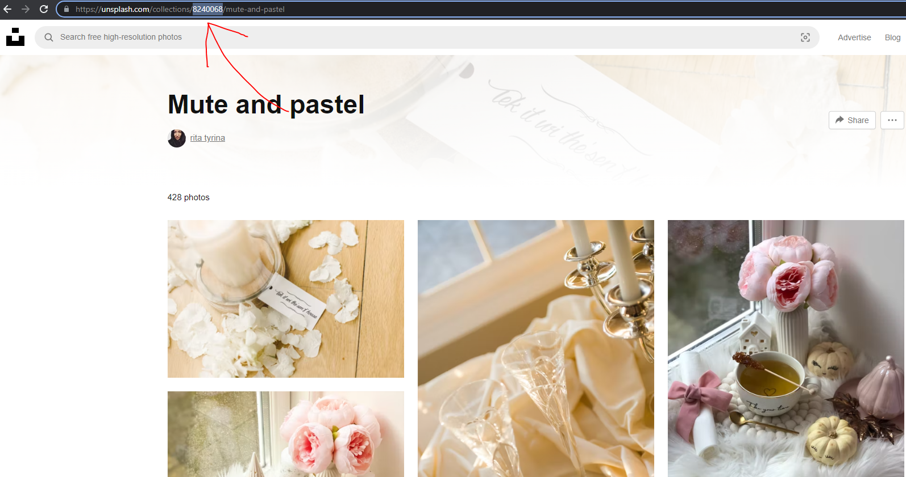

# unsplash-wallpapers

A CLI tool that helps download images from Unsplash collections.

## Usage

```bash
go build
./unsplash-wallpapers -c <collection_id>
```

The above commands will parse image urls from the collection and place them in the `./images/` directory.

Retrieve the `<collection_id>` as follows:



## Note

Currently, upto 100 images can be downloaded. This can be changed with the pagination settings.

Please provide a `.env` file with the following to gain access to the Unsplash API. See the [documentation](https://unsplash.com/developers) for details.

```text
SECRET=
ACCESS=
```

A [fixture](./collections/collections.json) with the expected API response from Unsplash is provided for convenience. [quicktype](https://app.quicktype.io/) was used to auto generate the struct based on the example fixture.
